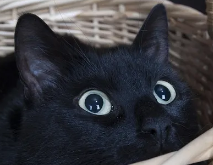

# lsbstego
Python script that encrypts data using AES-256-CBC, then hides the encrypted data inside an image's pixels using key-based pseudo-random positions for LSB steganography
### Hide command arguments
| Argument       | Description                               |
| -------------- | ----------------------------------------- |
| `image`        | Path to the image file                    |
| `key`          | AES key (32 characters)                   |
| `iv`           | Initialization vector (16 characters)     |
| `output`       | Output image path (default: `output.png`) |
| `--text TEXT`  | Text to hide                              |
| `--file FILE`  | File to hide                              |
| `-h, --help`   | Show help message and exit                |
### Extract command arguments
| Argument       | Description                           |
| -------------- | ------------------------------------- |
| `image`        | Path to the image file                |
| `key`          | AES key (32 characters)               |
| `iv`           | Initialization vector (16 characters) |
| `--text`       | Extract as text (default)             |
| `--file`       | Extract as file                       |
| `-h, --help`   | Show help message and exit            |
### Example commands
- hide text:
```
python lsbstego.py hide cat.png MyNewSecretKeyForAES256Crypto123 InitVectorAES16b output.png --text "hidden text in the image"
```
- hide file:
```
python lsbstego.py hide cat.png MyNewSecretKeyForAES256Crypto123 InitVectorAES16b output.png --file /file/path
```
- extract text:
```
python lsbstego.py extract output.png MyNewSecretKeyForAES256Crypto123 InitVectorAES16b
```
- extract file:
```
python lsbstego.py extract output.png MyNewSecretKeyForAES256Crypto123 InitVectorAES16b --file
```
### Notes
- Files are automatically compressed before Base64 encoding except for already compressed formats
- Uses LCG pixel shuffling and per-pixel RGB channel permutations with random channel selection to complicate analysis
- The output needs to be lossless, like PNG or similar formats. Lossy formats like JPEG are fine for input if output is lossless
- Extracting large files from high-resolution images requires significant RAM
### Results
original png:


png with hidden encrypted text:


### Credits
Many thanks to the developers of [Pillow](https://github.com/python-pillow/Pillow), [PyCryptodome](https://github.com/Legrandin/pycryptodome) and all the other modules used in this project!
### Disclaimer
This is a tool for educational / personal use only — the author is not responsible for any misuse

Shield: [![CC BY-NC-SA 4.0][cc-by-nc-sa-shield]][cc-by-nc-sa]

This work is licensed under a
[Creative Commons Attribution-NonCommercial-ShareAlike 4.0 International License][cc-by-nc-sa].

[![CC BY-NC-SA 4.0][cc-by-nc-sa-image]][cc-by-nc-sa]

[cc-by-nc-sa]: http://creativecommons.org/licenses/by-nc-sa/4.0/
[cc-by-nc-sa-image]: https://licensebuttons.net/l/by-nc-sa/4.0/88x31.png
[cc-by-nc-sa-shield]: https://img.shields.io/badge/License-CC%20BY--NC--SA%204.0-lightgrey.svg
